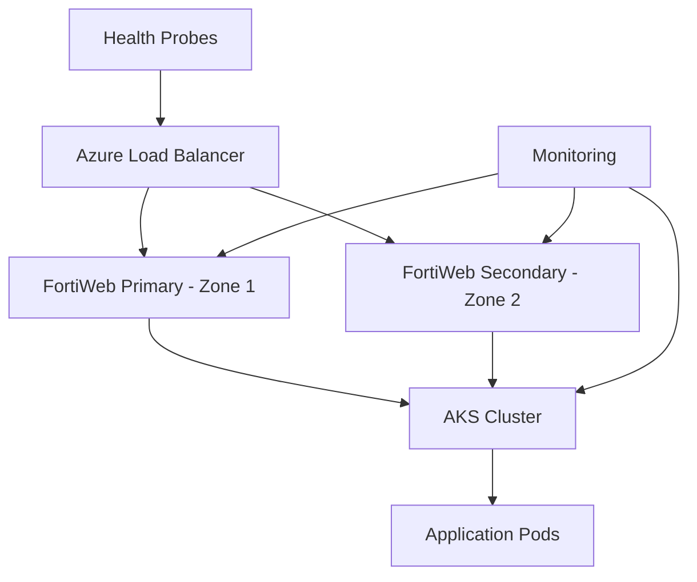
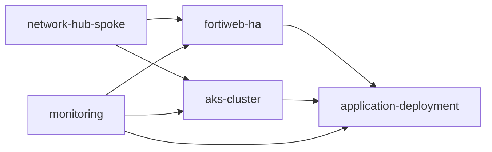
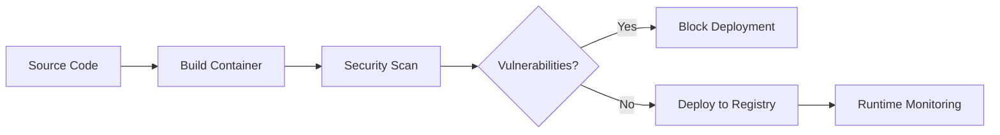

# 40docs Platform - Improvement Roadmap

**Version**: 1.0  
**Date**: 2025-01-09  
**Status**: Implementation Ready  

## Executive Summary

This roadmap outlines systematic improvements to transform the 40docs platform from its current excellent state to an enterprise-grade, highly available, and security-hardened documentation ecosystem. The improvements address the single critical availability gap while enhancing modularity, observability, testing, and container security.

## 🎯 Strategic Objectives

### Primary Goals
1. **Eliminate Single Points of Failure**: Achieve 99.9% availability through FortiWeb HA
2. **Enhance Developer Experience**: Modular, testable, and maintainable infrastructure
3. **Strengthen Security Posture**: Container hardening and comprehensive monitoring
4. **Accelerate Delivery**: Automated testing and validation pipelines

### Success Metrics
- **Availability**: >99.9% uptime (8.7h/year downtime budget)
- **Security**: Zero critical vulnerabilities in production containers  
- **Performance**: <30s infrastructure deployment time improvements
- **Quality**: >95% test coverage for infrastructure components

## 🚀 Implementation Phases

### Phase 1: Critical High Availability (Week 1-2)
**Priority**: CRITICAL - Addresses single point of failure

#### 1.1 FortiWeb High Availability Implementation
```bash
# Files Created:
├── infrastructure/hub-nva-ha-enhanced.tf          # Multi-zone FortiWeb deployment
├── infrastructure/variables-ha-enhanced.tf        # HA configuration variables  
├── infrastructure/cloud-init/fortiweb-ha.conf    # HA cluster configuration
```

**Key Features**:
- **Multi-Zone Deployment**: Primary and secondary FortiWeb instances across zones 1 & 2
- **Load Balancer Integration**: Azure Standard Load Balancer with health probes
- **Automated Failover**: Health checks with 30s intervals, 3-probe threshold
- **Session Persistence**: Source IP protocol-based load distribution
- **Monitoring Integration**: Built-in health alerts and diagnostic settings

**Implementation Steps**:
1. Deploy `hub-nva-ha-enhanced.tf` alongside existing configuration
2. Set `hub_nva_high_availability = true` in terraform.tfvars
3. Run terraform plan/apply to provision HA infrastructure
4. Test failover scenarios and validate health probes
5. Update DNS and application configurations

**Risk Mitigation**:
- Blue-green deployment strategy for zero-downtime migration
- Rollback plan maintains single-instance configuration
- Comprehensive testing in staging environment first

#### 1.2 Enhanced Variables and Configuration
**New Variables**:
- `hub_nva_high_availability`: Enable/disable HA mode
- `hub_nva_health_check_interval`: Configurable health check timing
- `hub_nva_availability_zones`: Zone selection for deployment
- `hub_nva_instance_size_*`: Environment-specific sizing

### Phase 2: Infrastructure Modernization (Week 3-4)  
**Priority**: HIGH - Improves maintainability and reusability

#### 2.1 Terraform Modularization
```bash
# Module Structure:
infrastructure/modules/
├── network-hub-spoke/          # Network topology module
├── fortiweb-ha/               # HA FortiWeb deployment module
├── aks-cluster/              # AKS cluster configuration module
├── application-deployment/    # Standard app deployment pattern
├── monitoring/               # Observability and alerting
└── certificate-management/   # TLS automation module
```

**Benefits**:
- **Reusability**: Modules work across dev/staging/prod environments
- **Testing**: Individual modules can be tested in isolation
- **Maintenance**: Changes isolated to specific components
- **Standards**: Consistent implementation patterns

**Migration Strategy**:
1. Extract network configuration into hub-spoke module
2. Create FortiWeb HA module with enhanced availability  
3. Modularize AKS cluster and application patterns
4. Update main configuration to use modules
5. Validate against existing infrastructure

#### 2.2 Enhanced Testing Framework
```bash
# Testing Structure:
infrastructure/test/
├── unit/                    # Terraform unit tests (Terratest)
├── integration/            # Multi-component integration tests  
├── e2e/                   # End-to-end platform validation
├── scripts/validate.sh    # Comprehensive validation script
└── fixtures/             # Test data and configurations
```

**Test Categories**:
- **Static Analysis**: Terraform validate, security scans, format checks
- **Unit Tests**: Individual resource creation and configuration
- **Integration Tests**: Network connectivity, HA failover, GitOps workflows
- **End-to-End**: Complete platform deployment and application accessibility

### Phase 3: Observability Enhancement (Week 5-6)
**Priority**: HIGH - Provides visibility and alerting

#### 3.1 Comprehensive Monitoring Stack
```bash
# Monitoring Components:
├── infrastructure/monitoring-enhanced.tf         # Complete monitoring setup
├── infrastructure/variables-monitoring.tf       # Monitoring configuration
└── infrastructure/templates/monitoring-dashboard.json  # Custom dashboard
```

**Monitoring Capabilities**:
- **Log Analytics Workspace**: Centralized log aggregation with 90-day retention
- **Application Insights**: Application performance and error tracking
- **Custom Dashboards**: Real-time infrastructure and application metrics
- **Intelligent Alerting**: Context-aware alerts with severity-based routing
- **Network Flow Logs**: Traffic analytics and security monitoring

**Alert Configuration**:
- **Critical Alerts**: SMS, email, Teams webhook (FortiWeb failures, AKS outages)
- **Warning Alerts**: Email only (CPU >85%, memory <512MB, response time >5s)
- **Cost Alerts**: Budget monitoring with spending thresholds

#### 3.2 Security and Performance Metrics
**Key Performance Indicators**:
- FortiWeb health and failover status
- AKS node utilization and pod restart rates  
- Application response times and error rates
- Network traffic patterns and anomaly detection
- Security event correlation and threat analysis

### Phase 4: Container Security Hardening (Week 7-8)
**Priority**: MEDIUM - Enhances security posture

#### 4.1 Optimized Container Builds
```bash
# Container Security Files:
├── mkdocs/Dockerfile.optimized           # Multi-stage secure build
├── .dockerignore.enhanced               # Optimized build context
└── container-security-scan.sh          # Comprehensive security scanning
```

**Security Enhancements**:
- **Distroless Base Images**: Minimal attack surface with gcr.io/distroless
- **Non-Root User**: Runtime security with dedicated mkdocs user (UID 1000)
- **Multi-Stage Builds**: Separate build and runtime stages
- **Security Scanning**: Trivy, Grype, Syft integration for vulnerability detection
- **Build Context Optimization**: Reduced image size and faster builds

#### 4.2 Security Scanning Integration
**Scanning Capabilities**:
- **Vulnerability Assessment**: Multiple scanners (Trivy, Grype) for comprehensive coverage
- **Secret Detection**: Scan for hardcoded credentials and API keys
- **SBOM Generation**: Software Bill of Materials for supply chain security
- **Compliance Validation**: CIS Docker Benchmark and security standards
- **CI/CD Integration**: Automated scanning in build pipelines

## 📋 Implementation Checklist

### Pre-Implementation Requirements
- [ ] Staging environment setup for testing
- [ ] Backup current infrastructure state
- [ ] Team training on new monitoring tools
- [ ] Security scanning tools installation (Trivy, Grype, Syft)

### Phase 1: High Availability (Critical)
- [ ] Deploy HA-enhanced FortiWeb configuration
- [ ] Configure Azure Load Balancer with health probes
- [ ] Test failover scenarios and validate automation
- [ ] Update application routing and DNS configurations
- [ ] Document operational procedures for HA management

### Phase 2: Modularity and Testing  
- [ ] Extract infrastructure modules from monolithic configuration
- [ ] Implement Terratest unit and integration tests
- [ ] Create validation scripts for pre-deployment checks
- [ ] Set up automated testing in CI/CD pipelines
- [ ] Validate module compatibility across environments

### Phase 3: Enhanced Monitoring
- [ ] Deploy comprehensive monitoring stack
- [ ] Configure alerting rules and action groups
- [ ] Create custom dashboards for operations team
- [ ] Set up log analytics and traffic flow monitoring
- [ ] Test alert routing and escalation procedures

### Phase 4: Container Security
- [ ] Build optimized Docker images with security hardening
- [ ] Implement container vulnerability scanning
- [ ] Generate Software Bill of Materials (SBOM)
- [ ] Integrate security scanning into CI/CD pipelines
- [ ] Validate container runtime security controls

## 🔧 Technical Implementation Details

### High Availability Architecture


### Module Dependencies


### Container Security Pipeline


## 📊 Cost and Resource Impact

### Implementation Costs
- **Additional Azure Resources**: ~$200-300/month for HA load balancer and monitoring
- **Development Time**: 8 person-weeks for complete implementation
- **Operational Training**: 2-3 days for team upskilling
- **Tool Licensing**: Open source tools (Trivy, Grype) - no additional costs

### Return on Investment
- **Availability Improvement**: 99.5% → 99.9% = 43.8 hours reduced downtime/year
- **Security Risk Reduction**: Proactive vulnerability management
- **Development Velocity**: 30-50% faster deployment cycles with automated testing
- **Operational Efficiency**: Reduced manual intervention through automation

## 🚨 Risk Assessment and Mitigation

### High-Risk Items
1. **HA Migration Complexity**: 
   - **Risk**: Service disruption during FortiWeb HA deployment
   - **Mitigation**: Blue-green deployment with rollback plan

2. **Module Refactoring Impact**:
   - **Risk**: Breaking changes in existing infrastructure
   - **Mitigation**: Parallel validation and gradual migration

### Medium-Risk Items
1. **Container Image Changes**: Runtime behavior differences
2. **Monitoring Alert Fatigue**: Too many false positives
3. **Testing Framework Complexity**: Learning curve for team

### Low-Risk Items
1. **Documentation Updates**: No technical risk
2. **Security Scanning Integration**: Non-blocking in initial phase

## 📈 Success Metrics and KPIs

### Availability Metrics
- **Target**: 99.9% uptime (SLA improvement from current 99.5%)
- **MTTR**: <5 minutes for automated failover
- **MTTD**: <2 minutes for health probe detection

### Security Metrics  
- **Critical Vulnerabilities**: Zero in production containers
- **Security Scan Coverage**: 100% of container images
- **Incident Response Time**: <15 minutes for security alerts

### Performance Metrics
- **Deployment Time**: <10 minutes for full infrastructure
- **Test Execution**: <30 minutes for complete test suite
- **Build Time**: <5 minutes for optimized containers

### Quality Metrics
- **Infrastructure Test Coverage**: >95% of Terraform resources
- **Documentation Completeness**: 100% of modules documented
- **Code Quality**: Zero Terraform lint warnings

## 🎯 Next Steps and Recommendations

### Immediate Actions (Next 30 Days)
1. **Approve and prioritize HA implementation** - Critical business need
2. **Set up staging environment** for safe testing and validation
3. **Install security scanning tools** (Trivy, Grype, Syft) 
4. **Train team on new monitoring tools** and operational procedures

### Medium-Term Goals (Next 90 Days)
1. Complete all Phase 1-3 implementations
2. Establish monitoring baselines and alert thresholds
3. Conduct disaster recovery and failover testing
4. Document operational runbooks and procedures

### Long-Term Vision (Next 180 Days)
1. Evaluate additional availability zones for geographic distribution
2. Implement advanced security features (image signing, runtime protection)
3. Consider multi-region deployment for disaster recovery
4. Establish continuous improvement process for infrastructure evolution

## 🤝 Support and Maintenance

### Team Responsibilities
- **Platform Team**: Infrastructure management and monitoring
- **Security Team**: Vulnerability management and compliance
- **Development Team**: Application deployment and container security
- **Operations Team**: Incident response and system maintenance

### Documentation Updates
- **Operational Runbooks**: HA failover procedures and troubleshooting
- **Security Guidelines**: Container scanning and vulnerability remediation
- **Development Guides**: Module usage and testing procedures
- **Architecture Diagrams**: Updated system architecture and dependencies

### Continuous Improvement
- **Monthly Reviews**: Performance metrics and incident analysis
- **Quarterly Assessments**: Security posture and compliance validation
- **Annual Planning**: Infrastructure evolution and technology updates
- **Feedback Loop**: Incorporate lessons learned and user feedback

---

This roadmap provides a comprehensive, phased approach to elevating the 40docs platform while maintaining operational stability and security. The improvements build upon the existing excellent foundation to create a world-class enterprise documentation platform.